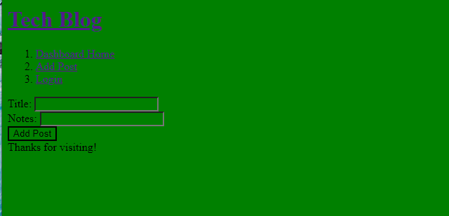
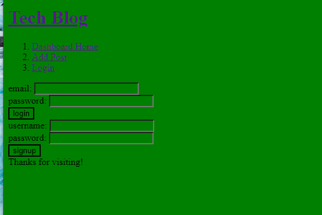

# tech-blog

## Project Description

This project allows a user to login to a tech blog website.

The user will be able to see all other posts from other users, as well as allow the user to post a link and note.

## Future Development

* I would like to clean up the UI and work more on the functionality

## Tools Used in This Project 

* Express
* JavaScript
* Handlebars

* Screenshots

;
;
;

